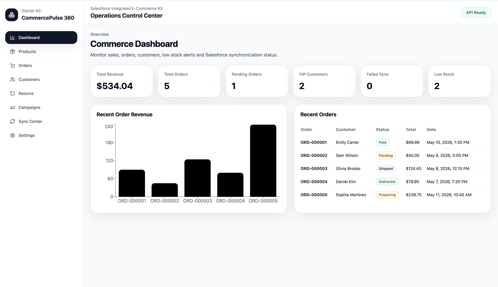
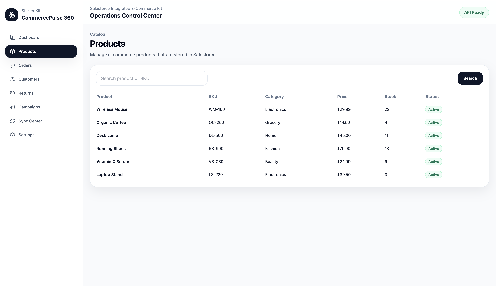
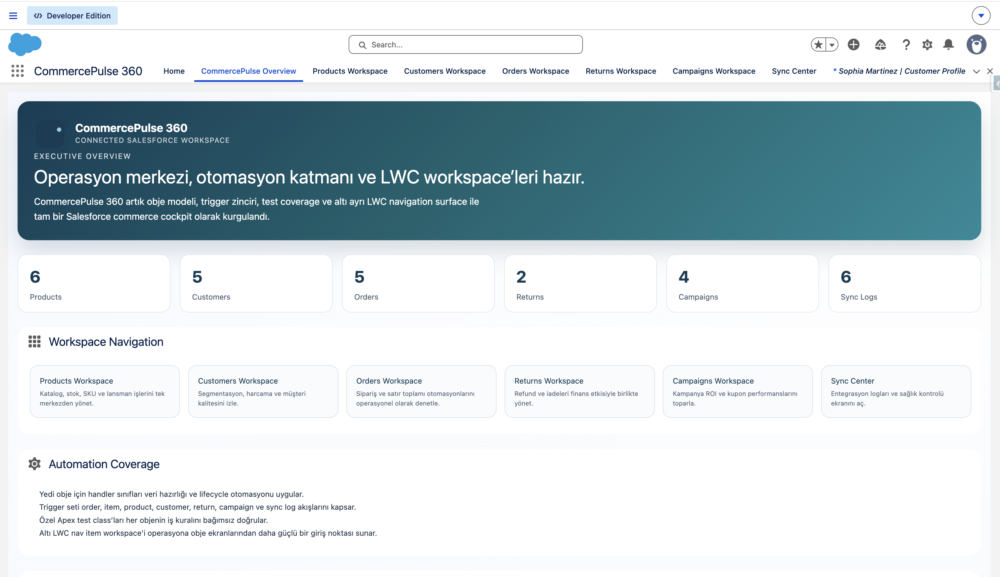
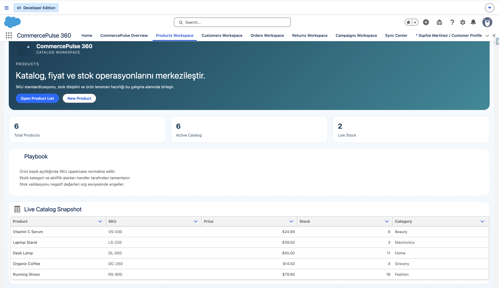
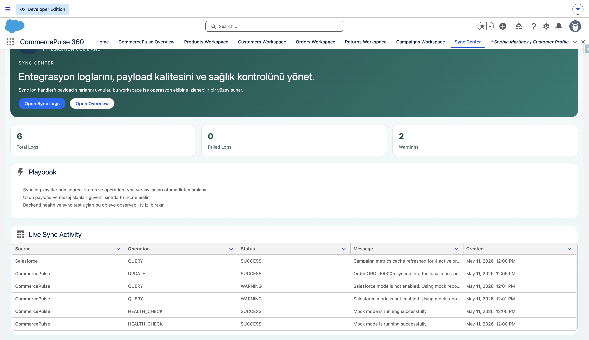
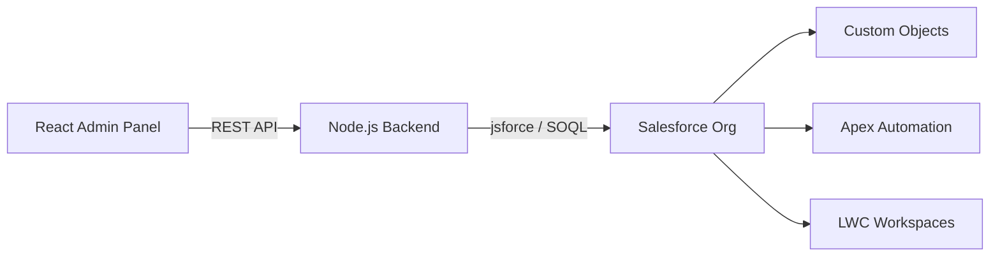

# CommercePulse 360

CommercePulse 360 is a Salesforce-integrated e-commerce operations starter kit that combines:

- a React admin panel for day-to-day operations
- a Node.js backend API for secure Salesforce access
- a Salesforce app with custom objects, Apex automation, and LWC workspaces

The project is designed for portfolio use, interviews, demos, and as a practical base for building commerce operations tools on top of Salesforce.

## What This Project Shows

- How to model e-commerce operations inside Salesforce
- How to keep Salesforce credentials out of the frontend
- How to expose Salesforce data through a clean backend API
- How to support both mock mode and real-org mode
- How to create both React and LWC experiences on the same business model

## Screenshots

### React Admin





### Salesforce LWC Workspaces







## Features

### React frontend

- Dashboard with revenue, orders, stock, customer, and sync metrics
- Product catalog management view
- Orders, customers, returns, campaigns, and sync log screens
- Works with either mock data or a live Salesforce org

### Backend API

- Express + TypeScript API gateway
- jsforce-based Salesforce integration
- Mock repository for local demos
- Salesforce repository for real records
- Zod validation and centralized error handling
- Seed script for loading sample records into Salesforce

### Salesforce app

- 7 custom objects for commerce operations
- Apex trigger handlers for defaults, normalization, and rollups
- Permission set for integration access
- LWC workspaces that show live Salesforce data

## Tech Stack

| Layer | Technology |
|---|---|
| Frontend | React, TypeScript, Vite, Tailwind CSS, React Router |
| Backend | Node.js, Express, TypeScript |
| Salesforce | Custom Objects, Apex, LWC, Permission Sets |
| Integration | jsforce, SOQL, Salesforce CLI alias auth |
| Validation | Zod |
| API Testing | Postman |

## Architecture



## Salesforce Data Model

| Label | API Name |
|---|---|
| Product | `Product__c` |
| Customer Profile | `Customer_Profile__c` |
| Commerce Order | `Commerce_Order__c` |
| Order Item | `Order_Item__c` |
| Return Request | `Return_Request__c` |
| Campaign Performance | `Campaign_Performance__c` |
| Sync Log | `Sync_Log__c` |

## Repository Structure

```text
.
├── backend/          # Node.js API gateway
├── docs/             # README assets such as screenshots
├── force-app/        # Salesforce source: objects, Apex, LWC, permissions
├── frontend/         # React admin panel
├── manifest/         # Salesforce metadata manifest
├── postman/          # Postman collection
├── scripts/          # Helper scripts
├── sfdx-project.json
└── README.md
```

## Local Development

### Requirements

- Node.js 20+
- npm
- Salesforce CLI (`sf`) if you want to use a real org

### 1. Clone the repository

```bash
git clone https://github.com/YOUR_USERNAME/commercepulse-360.git
cd commercepulse-360
```

### 2. Install and run the backend

```bash
cd backend
npm install
cp .env.example .env
npm run dev
```

Default backend URL:

```text
http://localhost:5000
```

### 3. Install and run the frontend

Open a second terminal:

```bash
cd frontend
npm install
cp .env.example .env
npm run dev
```

Default frontend URL:

```text
http://localhost:5173
```

## Run Modes

### Mock mode

Use this for a fast local demo without a Salesforce org.

In `backend/.env`:

```env
USE_MOCK_DATA=true
```

### Salesforce mode

Use this when you want the React app and backend to read from your real Salesforce org.

In `backend/.env`:

```env
USE_MOCK_DATA=false
```

You can authenticate in one of these ways:

```env
SALESFORCE_AUTH_ALIAS=your-sf-cli-alias
```

or

```env
SALESFORCE_USERNAME=your_salesforce_username
SALESFORCE_PASSWORD=your_salesforce_password
SALESFORCE_SECURITY_TOKEN=your_security_token
```

## Environment Variables

### Backend

```env
PORT=5000
NODE_ENV=development
CORS_ORIGIN=http://localhost:5173
USE_MOCK_DATA=true

SALESFORCE_LOGIN_URL=https://login.salesforce.com
SALESFORCE_AUTH_ALIAS=
SALESFORCE_USERNAME=your_salesforce_username
SALESFORCE_PASSWORD=your_salesforce_password
SALESFORCE_SECURITY_TOKEN=your_security_token
SALESFORCE_ACCESS_TOKEN=
SALESFORCE_INSTANCE_URL=
SALESFORCE_API_VERSION=60.0

LOW_STOCK_THRESHOLD=5
```

### Frontend

```env
VITE_API_BASE_URL=http://localhost:5000
```

## Salesforce Setup

### Deploy metadata

If you want to deploy the whole Salesforce app:

```bash
sf project deploy start --source-dir force-app --target-org YOUR_ALIAS
```

Or with the provided manifest:

```bash
sf project deploy start --manifest manifest/package.xml --target-org YOUR_ALIAS
```

### Assign permission set

```bash
sf org assign permset --target-org YOUR_ALIAS --name CommercePulseIntegrationUser
```

### Seed sample data

This project includes a seed script that loads example products, customers, orders, returns, campaigns, and sync logs into Salesforce.

```bash
cd backend
npm run seed:salesforce
```

For alias-based auth, set:

```env
SALESFORCE_AUTH_ALIAS=YOUR_ALIAS
USE_MOCK_DATA=false
```

## Useful Commands

### Backend

```bash
cd backend
npm run dev
npm run build
npm run start
npm run seed:salesforce
```

### Frontend

```bash
cd frontend
npm run dev
npm run build
npm run preview
```

### Salesforce

```bash
sf project deploy start --source-dir force-app --target-org YOUR_ALIAS
sf org assign permset --target-org YOUR_ALIAS --name CommercePulseIntegrationUser
sf apex run test --target-org YOUR_ALIAS --test-level RunLocalTests
```

## API and Demo Assets

- Postman collection: [postman/CommercePulse360.postman_collection.json](postman/CommercePulse360.postman_collection.json)
- Salesforce source: [force-app](force-app)
- Backend API: [backend](backend)
- React frontend: [frontend](frontend)

## Why This Repo Is Useful Publicly

This repository is a good public GitHub showcase because it demonstrates:

- frontend development with React and TypeScript
- backend API design with Node.js and validation
- CRM and data modeling thinking inside Salesforce
- Apex automation and LWC workspace design
- realistic integration architecture rather than frontend-only CRUD

## Security Notes

- Never commit real Salesforce credentials
- Keep `.env` files out of version control
- Do not call Salesforce directly from the React app
- Prefer a dedicated integration user or CLI alias for org access

## License

MIT
