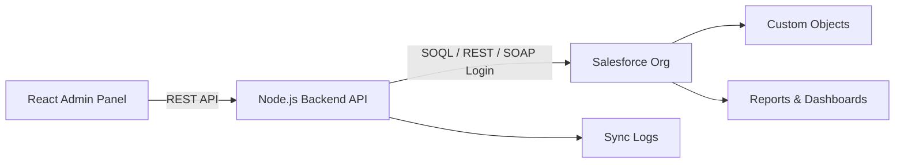

# CommercePulse 360 Kit

**CommercePulse 360 Kit** is an open-source Salesforce + React e-commerce operations starter kit.

It helps developers build a professional admin dashboard for:

- Products
- Customers
- Orders
- Order items
- Returns
- Campaign performance
- Salesforce sync monitoring

The project is designed for portfolio, interview, and real-world starter-kit usage.

> The goal is not only to show CRUD screens. The goal is to demonstrate how Salesforce can be used as a CRM and operational data hub for an e-commerce business.

---

## Tech Stack

| Layer | Technology |
|---|---|
| Frontend | React, TypeScript, Vite, Tailwind CSS, React Router |
| Backend | Node.js, Express, TypeScript |
| Salesforce Integration | jsforce, SOQL, Salesforce REST/SOAP login |
| Validation | Zod |
| Documentation | Markdown, Mermaid diagrams |
| API Testing | Postman collection |

---

## Repository Structure

```text
commercepulse-360-kit/
├── frontend/                 # React admin panel
├── backend/                  # Node.js API gateway for Salesforce
├── docs/                     # Setup, architecture, API and interview docs
├── postman/                  # Postman collection
├── scripts/                  # Helper scripts
├── README.md
├── LICENSE
└── .gitignore
```

---

## Architecture



---

## Salesforce Objects

You will create these objects in your Salesforce org:

| Object Label | API Name |
|---|---|
| Product | `Product__c` |
| Customer Profile | `Customer_Profile__c` |
| Commerce Order | `Commerce_Order__c` |
| Order Item | `Order_Item__c` |
| Return Request | `Return_Request__c` |
| Campaign Performance | `Campaign_Performance__c` |
| Sync Log | `Sync_Log__c` |

Detailed setup is available here:

```text
docs/salesforce-object-setup.md
```


### Optional Apex Logic

The kit also includes optional Apex trigger examples:

```text
salesforce/apex/
```

These triggers recalculate order totals and customer segments inside Salesforce. Details:

```text
docs/salesforce-apex-optional.md
```


---

## Quick Start

### 1. Clone the project

```bash
git clone https://github.com/YOUR_USERNAME/commercepulse-360-kit.git
cd commercepulse-360-kit
```

### 2. Configure backend

```bash
cd backend
cp .env.example .env
npm install
npm run dev
```

By default, backend can run with mock data:

```env
USE_MOCK_DATA=true
```

When your Salesforce org is ready, change it to:

```env
USE_MOCK_DATA=false
```

Then fill your Salesforce credentials in `backend/.env`.

### 3. Configure frontend

Open a new terminal:

```bash
cd frontend
cp .env.example .env
npm install
npm run dev
```

Default frontend URL:

```text
http://localhost:5173
```

Default backend URL:

```text
http://localhost:5000
```

---

## Backend Environment Variables

```env
PORT=5000
NODE_ENV=development
CORS_ORIGIN=http://localhost:5173
USE_MOCK_DATA=true

SALESFORCE_LOGIN_URL=https://login.salesforce.com
SALESFORCE_USERNAME=your_salesforce_username
SALESFORCE_PASSWORD=your_salesforce_password
SALESFORCE_SECURITY_TOKEN=your_security_token
SALESFORCE_API_VERSION=60.0

LOW_STOCK_THRESHOLD=5
```

Never commit real credentials to GitHub.

---

## Main Features

### React Admin Panel

- Professional dashboard
- Product management
- Order management
- Customer profiles
- Return request tracking
- Campaign performance screen
- Salesforce Sync Center
- Settings page

### Backend API

- Clean controller/service/repository structure
- Mock repository for local demo usage
- Salesforce repository for real org integration
- Zod request validation
- Centralized error handling
- Sync log creation
- Health check endpoint

### Salesforce

- Custom object model
- CRM-style e-commerce data hub
- Order/customer relationship
- Campaign and return tracking
- Sync log object for integration observability

---

## Interview Explanation

You can explain the project like this:

> I built CommercePulse 360 Kit as a Salesforce-integrated e-commerce operations starter kit. React provides the admin dashboard, Node.js works as a backend API gateway, and Salesforce stores business records such as products, customers, orders, returns, campaigns, and sync logs. The project supports mock mode for easy local testing and Salesforce mode for real CRM integration. My goal was to show not only frontend skills but also CRM data modeling, API integration, error handling, synchronization visibility, and real business workflow thinking.

More interview notes:

```text
docs/interview-explanation.md
```

---

## Build Commands

### Backend

```bash
cd backend
npm run build
npm start
```

### Frontend

```bash
cd frontend
npm run build
npm run preview
```

---

## Security Notes

- Do not call Salesforce directly from React.
- Store Salesforce credentials only on the backend.
- Do not commit `.env`.
- Use a Salesforce integration user where possible.
- Restrict object and field permissions with permission sets.
- Prefer OAuth production flows for real deployments.

---

## License

MIT License
