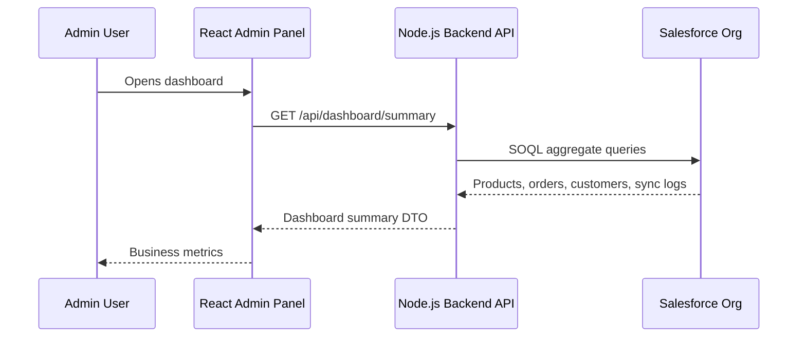
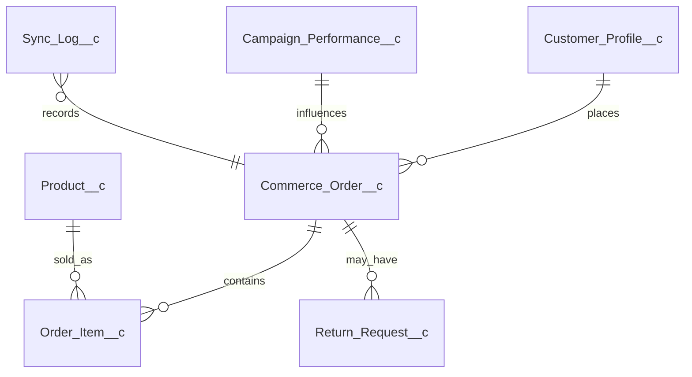

# Architecture

CommercePulse 360 Kit is designed as a clean starter kit, not only a demo.

## High-Level Flow



## Why React does not call Salesforce directly

Salesforce credentials must never be exposed in the browser. The backend protects credentials, centralizes security, handles retries, logs sync failures, and controls how Salesforce data is shaped for the frontend.

## Layers

```text
frontend/
  components/
  pages/
  services/
  types/

backend/
  controllers/
  services/
  repositories/
  salesforce/
  middleware/
  config/
```

## Backend Design

The backend uses a repository interface:

```text
ICommerceRepository
        |
        |-- MockCommerceRepository
        |-- SalesforceCommerceRepository
```

This allows the project to run in two modes:

| Mode | Purpose |
|---|---|
| Mock mode | Run the UI and API without Salesforce |
| Salesforce mode | Connect to a real Salesforce org |

## Object Model


